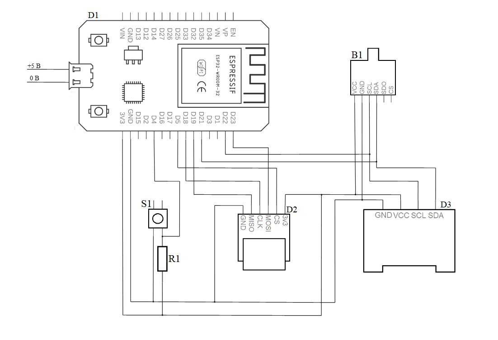
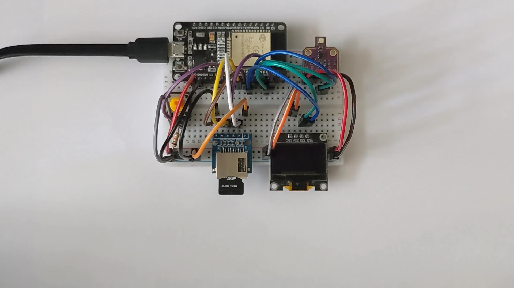

# Scalable Computer System for Climate Monitoring

This repository contains the firmware source code, hardware schematics, and academic documentation for my Bachelor's degree project developed at **Igor Sikorsky Kyiv Polytechnic Institute (KPI)**. 

The project focuses on creating an autonomous, scalable hardware-software complex for real-time monitoring of environmental metrics.

## 🎓 Academic Context
* **University:** Igor Sikorsky Kyiv Polytechnic Institute (KPI)
* **Faculty:** Faculty of Applied Mathematics
* **Department:** Department of System Programming and Specialized Computer Systems (SP&SCS)
* **Author:** Illia Stetsiurenko

**Project Committee:**
* **Supervisor:** A. V. Petrashenko, Ph.D., Associate Professor (SP&SCS Dept.)
* **Norm Controller:** Ya. M. Kliatchenko, Ph.D., Associate Professor (SP&SCS Dept.)
* **Reviewer:** V. Ya. Yurchyshyn, Ph.D., Associate Professor (SE&CS Dept.)

## 📌 Project Overview
The system is designed to collect, process, log, and visualize climate data (temperature, humidity, pressure, and air quality) in real-time. It is built on a scalable architecture, allowing it to function as a standalone unit or as a sensor node within a larger IoT infrastructure. 

### Key Features:
* **Real-time sensing:** High-precision data acquisition using the BME680 environmental sensor.
* **Local Data Logging:** Offline data backup utilizing a MicroSD card module.
* **On-board Visualization:** Immediate data display via an I2C OLED screen.
* **C/C++ Core:** Firmware developed using C/C++ for optimal performance and resource management on the ESP32 platform.

## 🛠 Hardware Components
The physical prototype was built using the following components:
* **Microcontroller:** ESP-WROOM-32 DevKit V1
* **Environmental Sensor:** BME680 (Temperature, Humidity, Barometric Pressure, Gas/VOCs)
* **Display:** OLED LCD 0.96" 128x64 (I2C interface)
* **Storage:** MicroSD Card Module (SPI interface)
* **Passive Components:** Resistor 10kΩ (0.25W, 5%)
* **Input:** Tactile push button switch (KFC-012-7.3)

## 🧪 Testing & Validation
Rigorous testing was conducted to ensure system stability and measurement accuracy:
* **Error Handling Logs:** Documented system reactions to simulated hardware failures (e.g., sensor disconnection, I2C bus errors, SD card initialization failures). Ensures the system recovers or reports errors gracefully without hard crashing.
* **Altimeter Validation:** Real-world testing of the BME680 barometric pressure sensor across different physical elevations to verify the accuracy of altitude calculation algorithms. 

## 📂 Repository Structure
* `/src/weather_station.ino` — Main C/C++ firmware source code.
* `/tests/` — Directory containing altitude validation screenshots and error handling logs.
* `/docs/Bachelor_Thesis_Full_Text.docx` — Complete academic paper (in Ukrainian).
* `/images/hardware_schema.png` — Detailed electrical wiring diagram.
* `/images/data_transmission_flowchart.png` — Logic flowchart of data acquisition and transfer.
* `/images/device_view.jpg` — Photograph of the assembled hardware prototype.
* `/images/schema_legend.jpg` — Legend and component explanations for the electrical schema.

## 🖼 Visuals
### Connection Diagram

### Prototype View

---
*This project was successfully defended as a requirement for the Bachelor's degree in Computer Engineering.*
